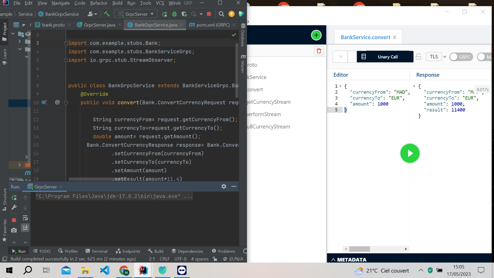
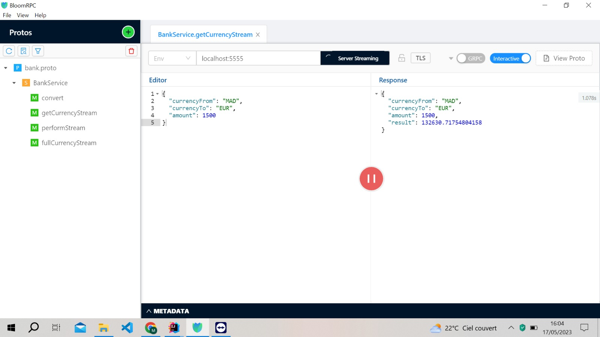
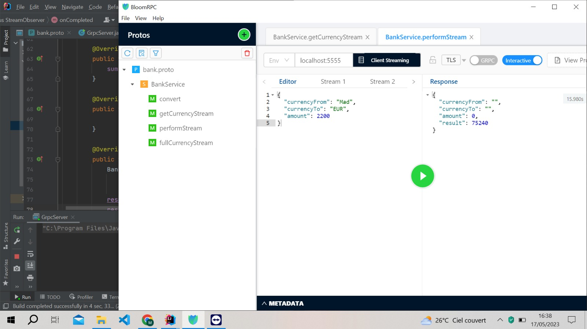
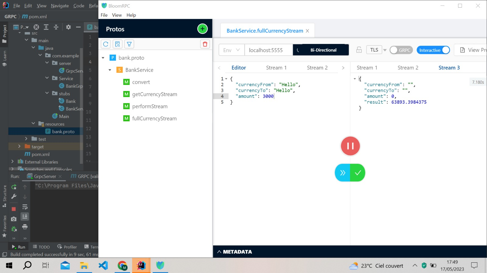
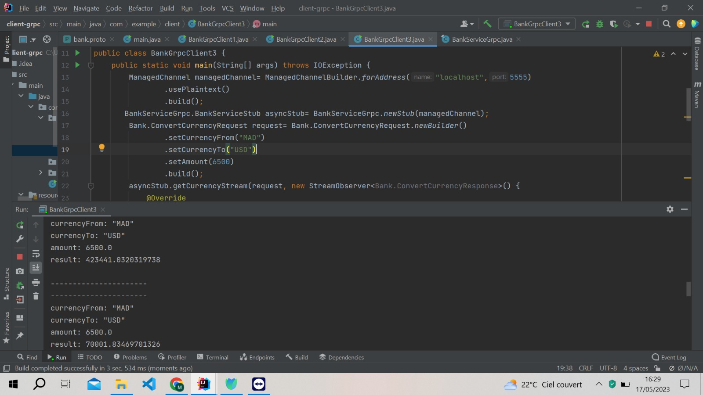

<h1>Devoir GRPC</h1>
<h3> ceation d'un fichier .proto dans src/main/resources pour le compiler pour faire la compilation du fichier .proto sur va sur Maven sur va sur lifecycle on selectionne validate et package.</h3>
<h3>Après cela la compilateur Maven me génère deux fichiers</h3>
Banque
BankServiceGrpc
Pour tester notre configuration :

On crée un serveur GRPC et on teste sur  BloomRPC
<h4>Pour créer un client GRPC en suivant les mêmes étapes :On importe les dépendances Maven,on importe le même fichier .proto,on génère les classes Bank et BankServiceGrpc</h4>
<h5>Dans un protocole GRPC, il y a deux types de communication synchrone et asynchrone</h5>

